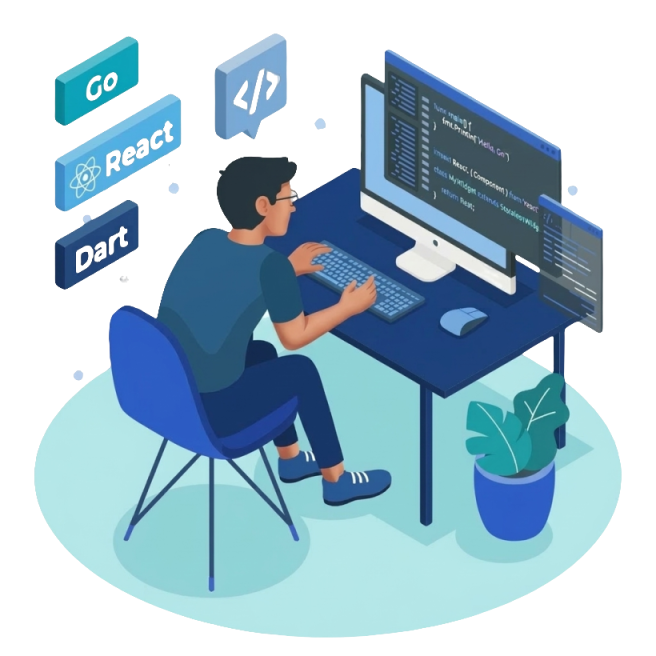

## Oi, eu sou o Gustavo Lóla 

Desenvolvedor de software apaixonado por criar experiências digitais que fazem a diferença. Transformando ideias em código que funcionam.

###  Linguagens

###  Ferramentas & Tecnologias

### Atualmente aprendendo

###  Onde me encontrar

  
  

---

### GitHub Stats

  

